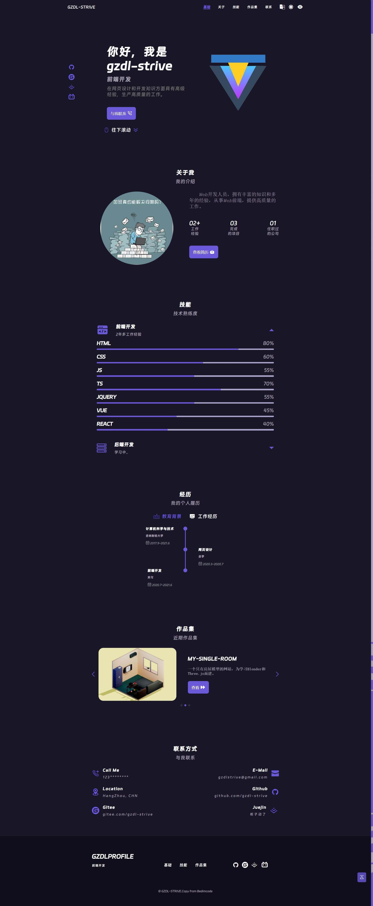

# gzdlprofile 

[English](README.md) | 中文

响应式网站 GZDL-STRIVE

响应式网站使用`HTML`、`CSS`和`JavaScript`，具有漂亮的用户界面。它包含一个标题、基础、关于、技能、个人经历、联系人和页脚。 参考 <a href="http://https://github.com/bedimcode/" target="_blank">Bedimcode</a> 的响应式网站而构建。

## 介绍
- *目标*：
  - 构建一个响应式网站，能够支持pc、移动端等多种设备响应的网站——简单介绍自己。
- *契机*：
  - 重学前端——萌生构建一个响应式网站的想法
  - 学习并巩固知识

## 规范
- `HTML规范`
  - 命名规范
    - 语义化
  - 注释
  - 代码风格
    - 2个空格缩进
- `CSS规范`
  - 命名规范
    - CSS变量命名规范
    - BEM类名规范
  - 注释
  - 代码风格
    - 2个空格缩进
  - 样式表拆分
- `JS规范`
  - 命名风格
  - 注释
  - 代码风格
    - 2个空格缩进 
  - 模块化
  - 公用函数拆分

## 作者
* gzdl-strive

## 图例
